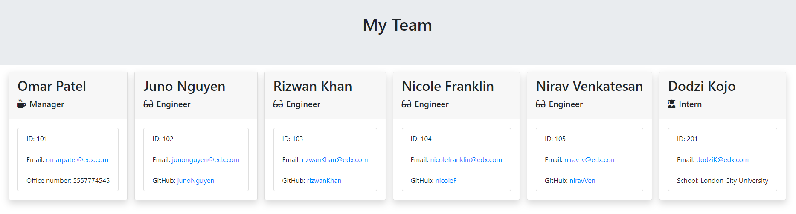
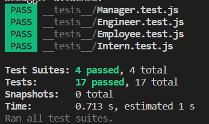

<!-- omit in toc -->
# Test-Driven Development: Team Profile Generator

## Description
This command line based Node.js app can be used to take in information about employees on a software engineering team, then generate an HTML webpage that displays summaries for each person.

## Table of Contents
- [Description](#description)
- [Table of Contents](#table-of-contents)
- [Preview](#preview)
  - [Sample Output](#sample-output)
- [Installation Instructions](#installation-instructions)
- [Usage](#usage)
- [License](#license)
- [Contributing](#contributing)
- [Tests](#tests)
- [Questions](#questions)

## Preview

### Sample Output
[Generated HTML file](https://github.com/dodzikojo/TTD-Team-Profile-Generator/blob/main/output/team.html)

## Installation Instructions
Node.js is required to run. Clone the repo at https://github.com/dodzikojo/TTD-Team-Profile-Generator

## Usage
- Navigate to project folder in the terminal.
- Type "node index.js"
- Follow all questions displayed
- An HTML file named will be generated in a folder named "Output".

## License
MIT License

Copyright (c) 2023 Dodzi Agbenorku

Permission is hereby granted, free of charge, to any person obtaining a copy
of this software and associated documentation files (the "Software"), to deal
in the Software without restriction, including without limitation the rights
to use, copy, modify, merge, publish, distribute, sublicense, and/or sell
copies of the Software, and to permit persons to whom the Software is
furnished to do so, subject to the following conditions:

The above copyright notice and this permission notice shall be included in all
copies or substantial portions of the Software.

THE SOFTWARE IS PROVIDED "AS IS", WITHOUT WARRANTY OF ANY KIND, EXPRESS OR
IMPLIED, INCLUDING BUT NOT LIMITED TO THE WARRANTIES OF MERCHANTABILITY,
FITNESS FOR A PARTICULAR PURPOSE AND NONINFRINGEMENT. IN NO EVENT SHALL THE
AUTHORS OR COPYRIGHT HOLDERS BE LIABLE FOR ANY CLAIM, DAMAGES OR OTHER
LIABILITY, WHETHER IN AN ACTION OF CONTRACT, TORT OR OTHERWISE, ARISING FROM,
OUT OF OR IN CONNECTION WITH THE SOFTWARE OR THE USE OR OTHER DEALINGS IN THE
SOFTWARE.

## Contributing
If you would like to contribute, feel free to create a Pull Request, or give us Bug Report.

## Tests
To test run "npm test" in the command line

## Questions
If you have any questions, you can reach out to me here at https://github.com/dodzikojo.  
